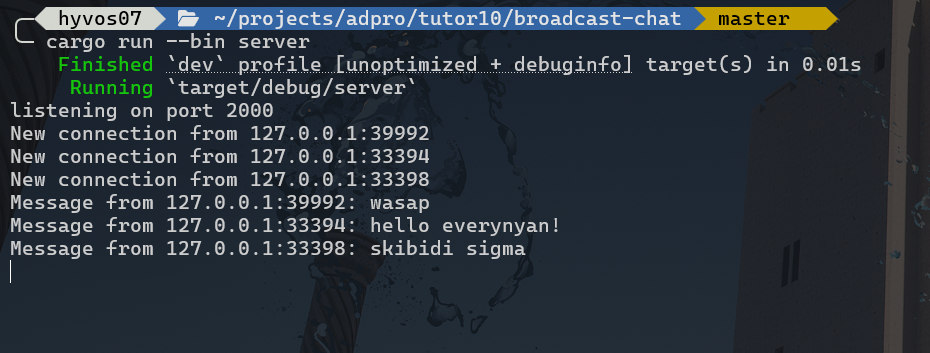
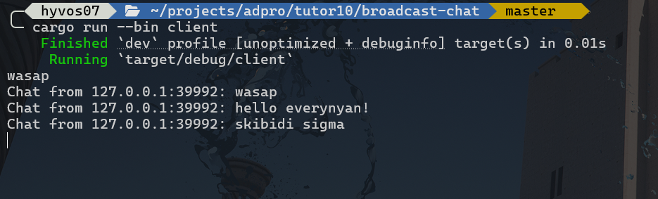
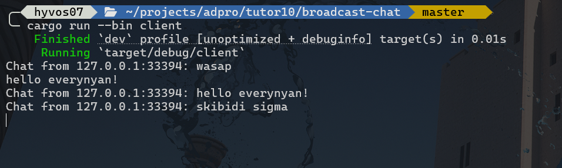
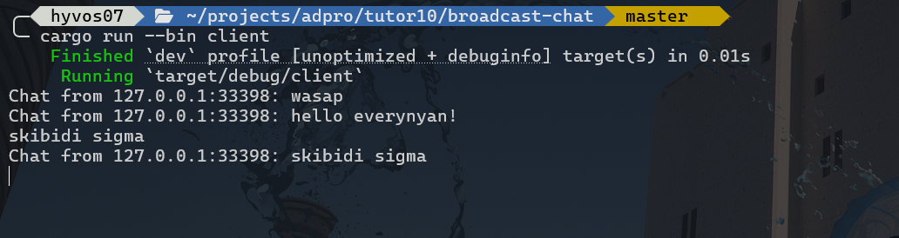
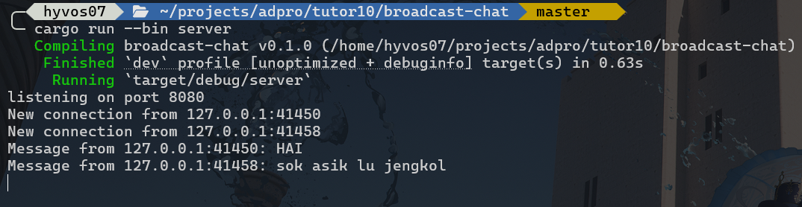
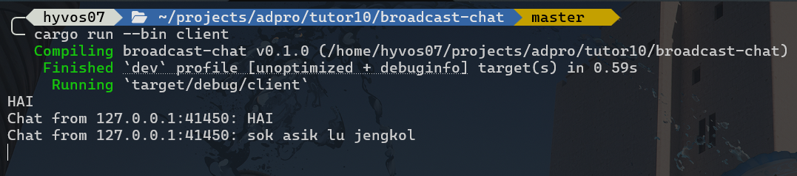
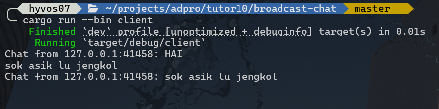

# 🦀 Advanced Programming - Asynchronus

**Nama**  : Daniel Liman <br>
**NPM**   : 2306220753 <br>
**Kelas** : Pemrograman Lanjut A

## Original Code of Broadcast Chat

### Server
<picture>
    
</picture>

### Client 1
<picture>
    
</picture>

### Client 2
<picture>
    
</picture>

### Client 3
<picture>
    
</picture>

<br>

Pada program ini, digunakan websocket sebagai penerima dan pengirim pesan (message) pada kedua sisi, server dan client. 

Pada sisi server, terdapat function `handle_connection()` yang berfungsi sebagai penerima dari koneksi dan pesan yang dikirim oleh client (lewat `bcast_tx.subscribe()`) dan menyebarkan pesan tersebut ke semua klien dengan menggunakan `ws_stream.send(Message::text(formatted_msg))` secara asinkronus.

Proses ini dilakukan dalam sebuah loop yang menerima pesan baru dan selanjutnya mengirimnya ke semua client seperti berikut:

```rs
loop {
    tokio::select! {
        // Receive message from client
        Some(msg) = ws_stream.next() => {
            let msg = msg?;
            if msg.is_text() {
                let text = msg.as_text().unwrap();
                println!("Message from {addr}: {text}");   // Logging
                bcast_tx.send(text.to_string())?;
            }
        }

        // Broadcast the message to all clients
        Ok(msg) = bcast_rx.recv() => {
            let formatted_msg = format!("{}: {}", addr, msg);
            ws_stream.send(Message::text(formatted_msg)).await?;
        }

        else => break,
    }
}
```

Pada sisi client, function main akan melakukan koneksi terlebih dahulu pada server dengan kode:

```rs
let (mut ws_stream, _) =
    ClientBuilder::from_uri(Uri::from_static("ws://127.0.0.1:2000"))
        .connect()
        .await?;
```

dan melakukan loop untuk mengambil input yang diketik pada terminal dengan memanfaatkan `stdin`. Program juga dirancang untuk menerima (apabila ada) pesan yang dikirim dari websocket server. 

Setelah diterima dengan baik, pesan tersebut akan selanjutnya ditampilkan di terminal dengan detail pengirim berupa address dari tempat connect mereka. Berikut logic dari loop yang mendukung kedua hal ini berjalan:

```rs
loop {
    tokio::select! {
        // Receive message from stdin
        Ok(Some(line)) = stdin.next_line() => {
            ws_stream.send(Message::text(line)).await?;
        }

        // Get incoming messages from server
        Some(msg) = ws_stream.next() => {
            let msg = msg?;
            if msg.is_text() {
                println!("Chat from {}", msg.as_text().unwrap().to_string());
            }
        }
        
        else => break,
    }
}
```

Penggunaan `tokio::select!` pada kedua sisi di aplikasi ini berguna untuk menerima event asinkronus yang terjadi terlebih dahulu, menerima pesan baru atau mengirim broadcast pada client di **server** maupun menerima input baru atau menerima pesan broadcast baru yang datang pada **client**. Dengan begitu, proses asinkronus akan lebih rapih dan tidak saling bertabrakan.


## Modifying The Websocket Port

### Server
<picture>
    
</picture>

### Client 1
<picture>
    
</picture>

### Client 2
<picture>
    
</picture>

<br>

Untuk mengubah server agar berjalan di port 8080, maka perlu diubah bagian berikut:

```rs
let listener = TcpListener::bind("127.0.0.1:8080").await?;
println!("listening on port 8080");
```

pada function main di `server.rs`. Selain itu, agar client juga dapat terhubung dengan benar pada server, perlu diubah ws_stream pada `client.rs` agar mengarah ke port yang benar setelah diubah ke 8080.

```rs
let (mut ws_stream, _) =
    ClientBuilder::from_uri(Uri::from_static("ws://127.0.0.1:8080"))
        .connect()
        .await?;
```

Jika tidak dihubungkan dengan port yang sama dengan tempat server berjalan, maka koneksi tidak akan ditanggapi/ditolak sehingga timbul error dari program seperti berikut:

```bash
Error: Io(Os { code: 111, kind: ConnectionRefused, message: "Connection refused" })
```